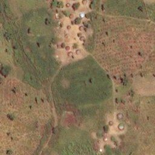
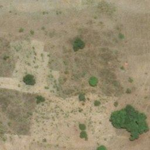
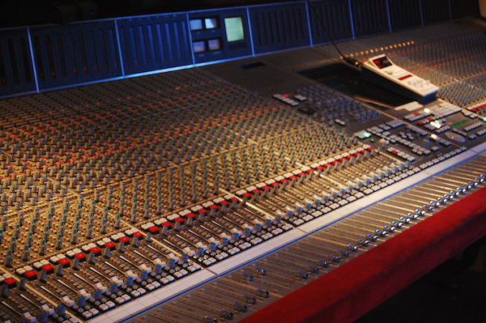

# mapswipe_convnet

Experiments using a Convolutional Neural Network with data from the MapSwipe project

This is a work in progress...

## Background

[The MapSwipe project](http://mapswipe.org/) uses a community of volunteers to tag satellite imagery displayed in a mobile phone app with features such as buildings and roads.

This human annotation of map image tiles, from Microsoft's Bing Maps, helps other volunteers in the Missing Maps project to create maps of parts of the world where these are missing. In doing so they help humanitarian groups working in the field deliver humanitarian aid.

I am interested in using machine learning and image processing techniques to help the MapSwipe project, perhaps through validation and/or augmentation of the existing approach.

Automated annotation of satellite image tiles is an interesting application of machine learning. The large datasets of annotations by MapSwipe volunteers combined with the image tiles, from Bing Maps, form a rich basis for this type of application.

For more information and for utility scripts that I use to prepare datsets for machine learning please take a look at my repo
[mapswipe_utils](https://github.com/craic/mapswipe_utils)

**mapswipe_convnet** contains my experiments using machine learning, and specifically Convolutional Neural Networks (Convnets), to
distinguish between Positive and Negative satellite image tiles. MapSwipe projects can aim to locate Buildings, Roads or both.
My work is focussing on Buildings for now and, initially, with the terrain of Nigeria where a number of MapSwipe projects have been based.

## Description of the Problem

The challenge for MapSwipe volunteers, and for machine learning, is to distinguich between image tiles that have no buildings and those that contain either
rectangular structures or circular huts, often in small groups. While rectangular structures are distinct, circular huts and trees are relatively similar.

Furthermore, we want to distinguish these against a background of terrain that includes, farmland, desert, scrub and forest.

Because MapSwipe tiles have been examined by human volunteers, often multiple times, we can have a good degree of
confidence in their assignment. These assignments form the basis for the machine learning training sets.

Example Positive Images

Images 1 and 2 contain rectangular buildings, images 1, 3, and 4 contain groups of circular huts

Example Negative Images

These images represent different types of terrain with no buildings

## Convnets and Image Classification

In my experiments with Convnets I have used two excellent resources:

[Deep Learning with Python](https://www.manning.com/books/deep-learning-with-python) by Francois Chollet,
the driving force behind the [Keras Deep Learning Library](https://keras.io/)

[Deep Learning for Computer Vision with Python](https://www.pyimagesearch.com/deep-learning-computer-vision-python-book/)
by Adrian Rosebrock

I recommend both of these.

## Hardware and Software Configuration

All my code is written in Python 3 and uses [Keras](https://keras.io/) with TensorFlow as the backend.

Earlier training runs took place on Amazon Web Services using a custom EC2 instance based on a preconfigured AMI created by Adrian Rosenbock and
described in this [tutorial](https://www.pyimagesearch.com/2017/09/20/pre-configured-amazon-aws-deep-learning-ami-with-python/)
which I run as a **p2.xlarge** instance which has a graphics card accelerator that is necessary for this sort of
computation. That costs about US $1 per hour.

Currently I am using a custom Ubuntu linux machine with a Nvidia GTX 1080TI graphics card.

## Experiments

Each experiment has its own directory with the specific training code used and example results.

These will not contain the sets of training images - these come from Microsoft Bing Maps and you need a developer key to download them.
I am sure it would contravene their Terms of Service to distribute the images, so you will need to download your own
sets if you want train your own system.

Neither will they contain the trained models, although I will store these on the AWS S3 servers and provide links to them.

With Convnets, the user is faced with a wide array of network architectures (models) and countless parameters that you
hope to optimize. It makes me think of a studio mixing desk.

[Experiment #1](experiment_1) - Basic Convnet with limited tuning

[Experiment #2](experiment_2) - VGG16 model with a much larger dataset

