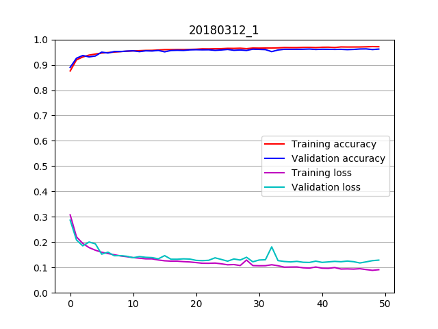

# Experiment 2

This experiment was based on the code used in Experiment 1 but with the model replaced by that from the VGG16 
network of [Simonyan and Zisserman](https://arxiv.org/abs/1409.1556) as implmented in the [Keras library](https://keras.io/).
See [this Keras file](https://github.com/keras-team/keras/blob/master/keras/applications/vgg16.py) for more details on their implementation.

[mapswipe_train_convnet_expt_2.py](mapswipe_train_convnet_expt_2.py)


# The Model 

```
_________________________________________________________________
Layer (type)                 Output Shape              Param #   
=================================================================
block1_conv1 (Conv2D)        (None, 224, 224, 64)      1792      
_________________________________________________________________
block1_conv2 (Conv2D)        (None, 224, 224, 64)      36928     
_________________________________________________________________
block1_pool (MaxPooling2D)   (None, 112, 112, 64)      0         
_________________________________________________________________
block2_conv1 (Conv2D)        (None, 112, 112, 128)     73856     
_________________________________________________________________
block2_conv2 (Conv2D)        (None, 112, 112, 128)     147584    
_________________________________________________________________
block2_pool (MaxPooling2D)   (None, 56, 56, 128)       0         
_________________________________________________________________
block3_conv1 (Conv2D)        (None, 56, 56, 256)       295168    
_________________________________________________________________
block3_conv2 (Conv2D)        (None, 56, 56, 256)       590080    
_________________________________________________________________
block3_conv3 (Conv2D)        (None, 56, 56, 256)       590080    
_________________________________________________________________
block3_pool (MaxPooling2D)   (None, 28, 28, 256)       0         
_________________________________________________________________
block4_conv1 (Conv2D)        (None, 28, 28, 512)       1180160   
_________________________________________________________________
block4_conv2 (Conv2D)        (None, 28, 28, 512)       2359808   
_________________________________________________________________
block4_conv3 (Conv2D)        (None, 28, 28, 512)       2359808   
_________________________________________________________________
block4_pool (MaxPooling2D)   (None, 14, 14, 512)       0         
_________________________________________________________________
block5_conv1 (Conv2D)        (None, 14, 14, 512)       2359808   
_________________________________________________________________
block5_conv2 (Conv2D)        (None, 14, 14, 512)       2359808   
_________________________________________________________________
block5_conv3 (Conv2D)        (None, 14, 14, 512)       2359808   
_________________________________________________________________
block5_pool (MaxPooling2D)   (None, 7, 7, 512)         0         
_________________________________________________________________
flatten (Flatten)            (None, 25088)             0         
_________________________________________________________________
fc1 (Dense)                  (None, 4096)              102764544 
_________________________________________________________________
fc2 (Dense)                  (None, 4096)              16781312  
_________________________________________________________________
predictions (Dense)          (None, 1)                 4097      
=================================================================
Total params: 134,264,641
Trainable params: 134,264,641
Non-trainable params: 0
_________________________________________________________________

```


## The Dataset

The dataset used was much larger than that used in Experiment 1. 
Image tiles from all MapSwipe projects at the end of January 2018, that had at least 5 votes marking them as Positive were 
downloaded and the same number of Negative tiles were selected as described previously. This yielded a total of 131,328
images in each class.

These were split into train, validation and test sets in the ratios of 0.7, 0.2, 0.1 respectively.


## Results

The model was trained for 50 epochs.

The model from the best epoch was saved and used to evaluate the Test dataset. This produced the results:
* loss 0.1184
* accuracy 0.9635




## Next Steps


